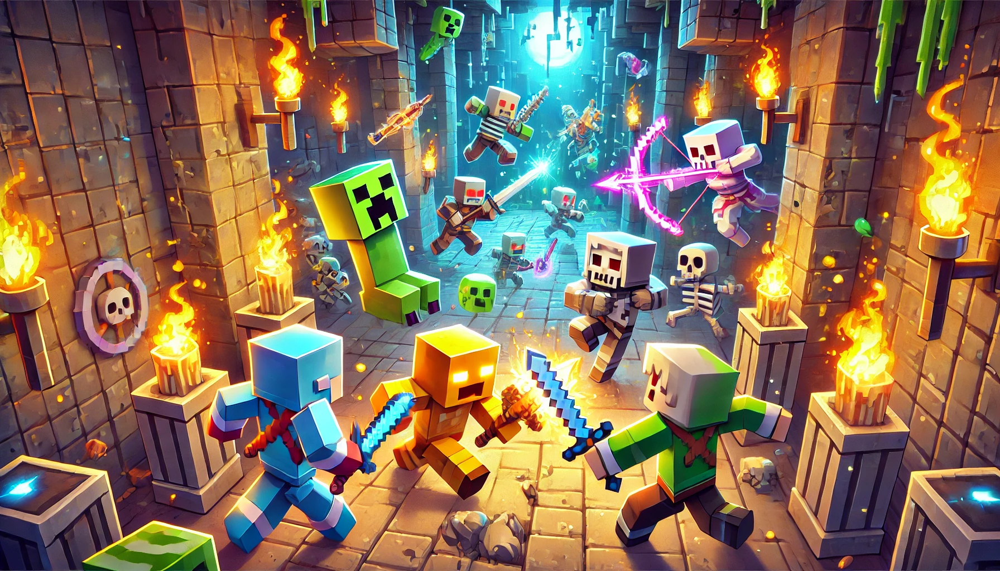

# HypedDungeon

⚠️ **WARNING: PORTFOLIO PROJECT ONLY** ⚠️

This is a demonstration project that showcases my development methodology for Minecraft plugins.

## ⚠️ Important Notice

- **NOT RECOMMENDED FOR PRODUCTION USE**
- **FOR ACADEMIC AND DEMONSTRATION PURPOSES ONLY**
- **NO OFFICIAL SUPPORT**
- **NO COMMITMENT TO UPDATES**
- **PULL REQUESTS WILL NOT BE REVIEWED**

## 🎯 Purpose

This project was created exclusively to demonstrate:
- Plugin Architecture
- Code Patterns
- Development Best Practices
- English Documentation
- Dependency Injection System
- Configuration Management
- Internationalization System

## 🔧 Development

If you wish to develop this project on your own, I recommend:

1. Fork the repository
2. Implement a reflection system to support multiple Minecraft versions
   - Or adapt the code to your specific server version
3. Add unit tests
4. Implement CI/CD
5. Document changes

## 🚀 Technologies

- Kotlin
- Bukkit/Spigot API
- Google Guice (Dependency Injection)
- Gradle

## 📝 License

This project is under the MIT License. See the [LICENSE](LICENSE) file for details.

## ⚠️ Disclaimer

This plugin was developed as part of my personal portfolio. There are no guarantees of functionality, support, or future updates. Use at your own risk.